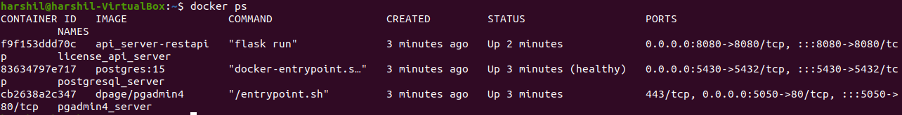

# API Server

This is rest api server designed to use for business central extension validation with the help of licensing.

### Flow Chart
(https://github.com/harshilpatel984/api_server/blob/main/documents/LICENSE_FLOW_CHART.drawio.pdf)

### Database Diagram
(https://github.com/harshilpatel984/api_server/blob/main/documents/License%20Management.pdf)

### Docker service deployment

#### Prerequisites

- Python 3.8
- Docker and Docker compose

```commandline
docker compose up -d
```

